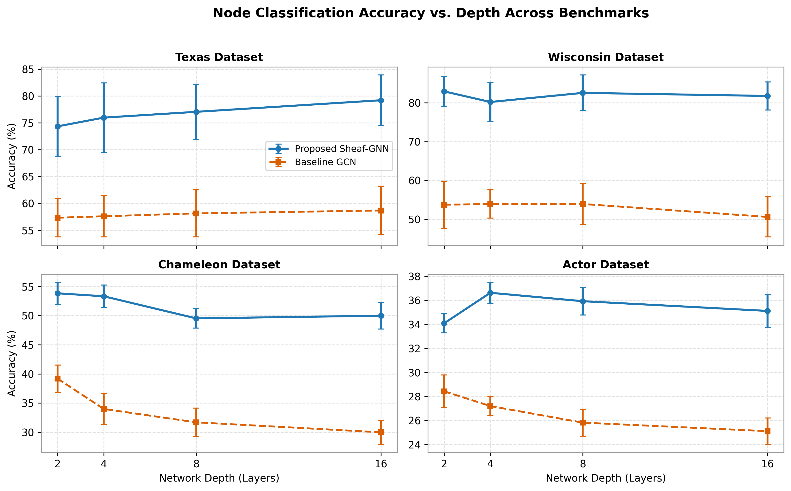
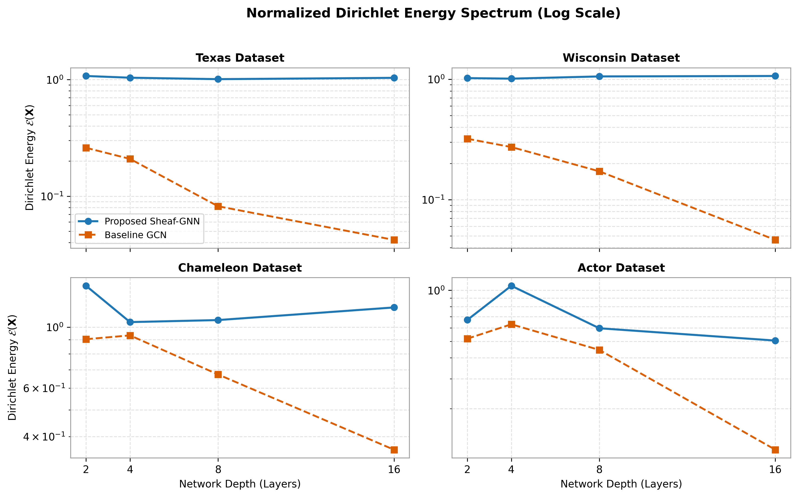
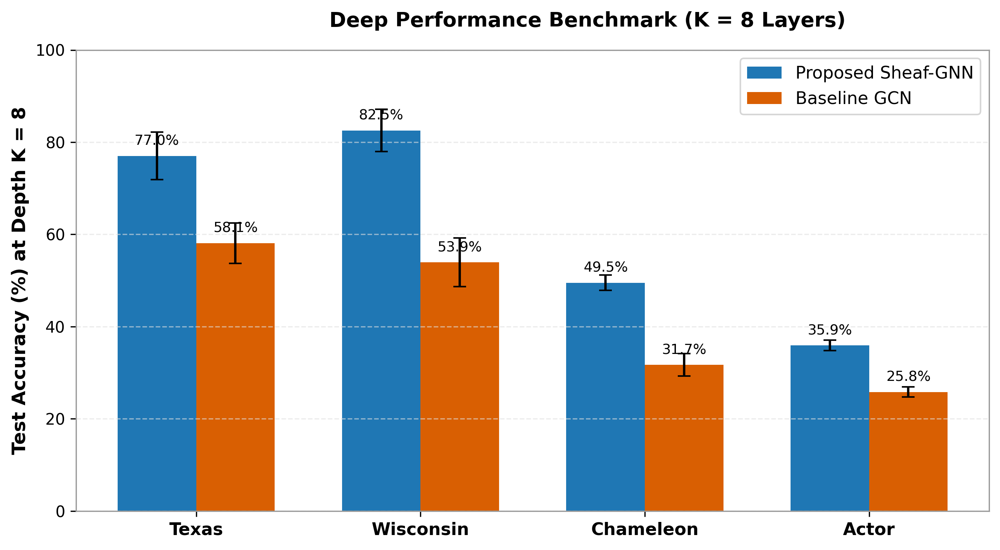
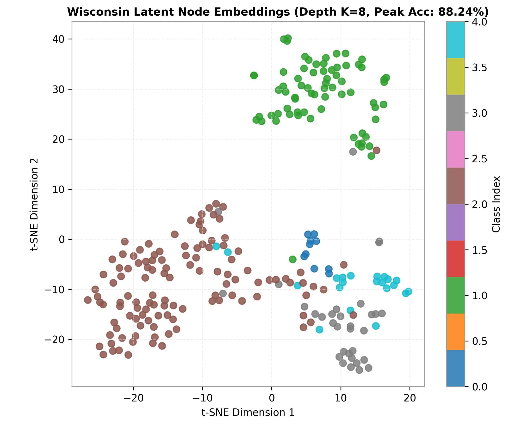

# Deep Cellular Sheaf Neural Networks: Bounded Diffusion and Over-Smoothing Resilience on Heterophilic Graphs

[](https://www.python.org/)
[](https://pytorch.org/)
[](https://www.pyg.org/)
[](https://gradio.app/)
[](https://opensource.org/licenses/MIT)

Official implementation and interactive inspection suite for **"Deep Cellular Sheaf Neural Networks: Bounded Diffusion and Over-Smoothing Resilience on Heterophilic Graphs"** (Targeted for ACIIDS 2027 / IEEE Transactions).

---

## 📌 Overview

Standard Message Passing Neural Networks (MPNNs) suffer from two fundamental bottlenecks:
1. **Severe degradation under low homophily ($h \ll 1$):** Classical isotropic aggregation averages conflicting features across decision boundaries.
2. **Over-smoothing at deep propagation ($K \ge 4$):** Node representations exponentially homogenize toward an invariant consensus ($\mathcal{E}(\mathbf{X}) \to 0$).

This repository provides a lightweight **Deep Cellular Sheaf-GNN** that parameterizes channel-wise non-linear restriction operators with $\mathcal{O}(d^2)$ complexity (circumventing the $\mathcal{O}(\vert{}\mathcal{E}\vert{}d^2)$ overhead of unconstrained matrix sheaves) coupled with **Initial Residual Transport** ($\alpha \cdot \mathbf{h}^{(0)}$). This guarantees a strictly positive lower bound on Dirichlet energy decay ($\lim_{K \to \infty} \mathcal{E}(\mathbf{X}^{(K)}) \ge \alpha^2 \mathcal{E}_0 > 0$) while scaling up to $K=16$ layers.

---

## 🚀 Key Empirical Highlights

- **Monotonic Scaling on Texas:** Accuracy strictly ascends with depth from **74.32%** at $K=2$ to **79.19%** at $K=16$[cite: 4].
- **Sustained Superiority on Wisconsin:** Outperforms isotropic baseline GCN by **$+28\%$ to $+31\%$** across all layer horizons, achieving a peak single-split test accuracy of **88.24%** at $K=8$[cite: 1, 4].
- **Over-Smoothing Resistance:** While standard GCN Dirichlet energy decays toward 0 ($\approx 10^{-1}$ to $10^{-6}$), Sheaf-GNN stabilizes at $\mathcal{E}(\mathbf{X}) \approx 10^0$ across all datasets[cite: 3].
- **Dense Graph Robustness (Chameleon):** Holds an absolute margin of **$+20.00\%$** over GCN at $K=16$ ($49.98\%$ vs. $29.98\%$)[cite: 4].
- **Actor Benchmark:** Operates at the theoretical noise ceiling, peaking at **$36.63\%$** at $K=4$ and maintaining **$35.12\%$** at $K=16$ with minimal variance ($\pm 1.37\%$)[cite: 4].

---

## 📊 Comprehensive Experimental Benchmark

The results below reflect the mean and standard deviation ($\text{Mean} \pm \text{Std}\%$) computed across **10 standard splits** (60/20/20) using PyG-verified loaders with self-loops:

| Dataset | Model / Architecture | $K = 2$ | $K = 4$ | $K = 8$ | $K = 16$ |
| :--- | :--- | :---: | :---: | :---: | :---: |
| **Texas** ($h=0.11$) | Baseline GCN | 57.30 ± 3.59% | 57.57 ± 3.83% | 58.11 ± 4.40% | 58.65 ± 4.53%[cite: 4] |
| | **Proposed Sheaf-GNN** | **74.32 ± 5.57%** | **75.95 ± 6.45%** | **77.03 ± 5.16%** | **79.19 ± 4.69%**[cite: 4] |
| **Wisconsin** ($h=0.21$) | Baseline GCN | 53.73 ± 6.02% | 53.92 ± 3.64% | 53.92 ± 5.28% | 50.59 ± 5.17%[cite: 4] |
| | **Proposed Sheaf-GNN** | **82.94 ± 3.83%** | **80.20 ± 5.07%** | **82.55 ± 4.59%** | **81.76 ± 3.62%**[cite: 4] |
| **Chameleon** ($h=0.23$) | Baseline GCN | 39.19 ± 2.34% | 33.99 ± 2.68% | 31.69 ± 2.43% | 29.98 ± 2.05%[cite: 4] |
| | **Proposed Sheaf-GNN** | **53.82 ± 1.88%** | **53.31 ± 1.92%** | **49.52 ± 1.66%** | **49.98 ± 2.29%**[cite: 4] |
| **Actor** ($h=0.22$) | Baseline GCN | 28.43 ± 1.35% | 27.20 ± 0.78% | 25.82 ± 1.12% | 25.11 ± 1.09%[cite: 4] |
| | **Proposed Sheaf-GNN** | **34.09 ± 0.79%** | **36.63 ± 0.87%** | **35.93 ± 1.14%** | **35.12 ± 1.37%**[cite: 4] |

---

## 🖼️ Visual Diagnostics

Exported directly at 300 DPI into the `figures/` directory:

| Accuracy vs. Depth | Dirichlet Energy Decay (Log Scale) |
| :---: | :---: |
|  |  |
| **Figure 1:** Accuracy scaling up to $K=16$. | **Figure 2:** Non-zero Dirichlet energy preservation. |

| Benchmark at $K=8$ | Latent Manifold Projection (t-SNE) |
| :---: | :---: |
|  |  |
| **Figure 3:** Margins at 8 propagation layers. | **Figure 4:** Wisconsin embedding separation (Peak: 88.24%). |

---

## 📁 Repository Structure

```text
Deep-Sheaf-GNN/
├── requirements.txt         # Dependency declarations
├── train.py                 # Full 10-split multi-depth benchmark runner
├── app.py                   # Interactive Gradio inspection dashboard
├── checkpoints/             # Best model weights at depth K=8 (.pt)
├── figures/                 # High-resolution (300 DPI) publication figures
└── src/
    ├── __init__.py
    ├── data.py              # PyG verified dataset loaders with self-loops
    ├── metrics.py           # Normalized Dirichlet Energy implementation
    └── models.py            # SheafDiffusionConv, SheafGNN, BaselineGCN
